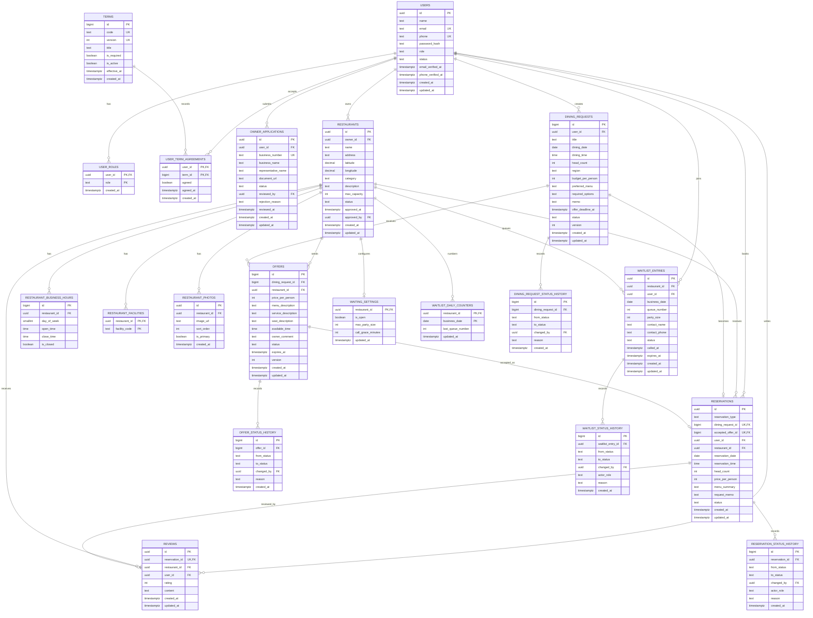

# 골라밥 PostgreSQL ERD

## 1. 목표 데이터 모델

## 2. 주요 키 전략

- 계정, 식당, 예약처럼 외부 시스템과 연결될 가능성이 큰 식별자는 UUID를 유지한다.
- 현재 API와 데이터 호환을 위해 회식 요청과 오퍼의 기본 키는 BIGINT를 유지한다.
- 모든 사용자 참조 컬럼은 `users.id`를 가리키는 UUID 외래 키로 통일한다.
- 시간은 업무상 날짜·시각이면 `DATE`와 `TIME`, 사건 발생 시각과 마감이면 `TIMESTAMPTZ`를 사용한다.

## 3. 필수 제약조건

| 테이블 | 제약조건 |
| --- | --- |
| users | 대소문자 무관 `email` 유일, E.164 `phone` 유일, `status IN ('active', 'suspended', 'withdrawn')` |
| user_roles | `(user_id, role)` 복합 PK, 역할 CHECK |
| terms | `(code, version)` 유일, 코드별 활성 버전 하나 |
| user_term_agreements | `(user_id, term_id)` 복합 PK, 동의 여부와 동의 시각 일치 |
| owner_applications | 활성 신청 중복 방지 부분 유일 인덱스 |
| restaurants | owner UUID FK, 상태 CHECK, 수용 인원 양수 |
| restaurant_business_hours | `(restaurant_id, day_of_week)` 유일, 요일 0~6 |
| dining_requests | 인원 2명 이상, 예산 양수, 상태 CHECK, 마감이 회식 시작보다 빠름 |
| offers | `(dining_request_id, restaurant_id)` 유일, 가격 양수, 상태 CHECK |
| reservations | 예약 유형 CHECK, nullable 요청·오퍼 참조의 부분 유일 인덱스, 상태 CHECK |
| reviews | `reservation_id` 유일, 평점 1~5 |
| waiting_settings | 최대 인원·호출 제한 시간 양수, 식당별 한 행 |
| waitlist_daily_counters | `(restaurant_id, business_date)` 복합 PK, 마지막 번호 0 이상 |
| waitlist_entries | `(restaurant_id, business_date, queue_number)` 유일, 상태 CHECK, 사용자별 활성 웨이팅 부분 유일 인덱스 |

## 4. 필수 인덱스

- `dining_requests(status, offer_deadline_at, dining_date, dining_time)`
- `dining_requests(user_id, created_at DESC)`
- `offers(dining_request_id, status, price_per_person)`
- `offers(restaurant_id, created_at DESC)`
- `restaurants(owner_id, status)`
- `restaurants(status, category)`
- `reservations(user_id, created_at DESC)`
- `reservations(restaurant_id, reservation_date, reservation_time)`
- `waitlist_entries(restaurant_id, business_date, status, queue_number)`
- `waitlist_entries(user_id, status, created_at DESC)`
- 각 상태 이력 테이블의 대상 FK와 `created_at DESC`

## 5. 현재 구조와의 차이

| 현재 구조 | 목표 구조 |
| --- | --- |
| 사용자 참조가 `TEXT`이고 FK가 없음 | UUID 타입과 `users(id)` FK 사용 |
| 식당 생성 기본 상태가 `approved` | 기본 상태 `pending`, 관리자 승인 후 `approved` |
| 영업시간·시설이 식당 단일 행에 포함 | 영업시간·시설·사진을 별도 검색 가능 테이블로 분리 |
| 예약 유형 구분이 없고 요청·선택 오퍼와 무관 | `offer` 예약은 요청·선택 오퍼를 연결하고 `direct` 예약은 직접 식당 예약으로 구분 |
| 상태 변경 이력이 없음 | 요청·오퍼·예약별 상태 이력 테이블 추가 |
| 웨이팅 데이터 구조가 없음 | 식당 설정, 대기 항목, 상태 이력 테이블 추가 |
| 계정 상태와 사업자 신청이 없음 | 계정 상태와 owner 신청·심사 구조 추가 |

## 6. 삭제 정책

- 운영 데이터는 기본적으로 물리 삭제하지 않고 상태 변경으로 보존한다.
- 사용자 탈퇴는 `withdrawn` 처리하고 법적 보존 기간 후 개인정보를 익명화한다.
- 식당·요청·오퍼·예약은 참조 이력 때문에 물리 삭제 API를 제공하지 않는다.
- 개발·테스트 데이터 정리는 명시적인 관리 스크립트에서 FK 역순으로 수행한다.
