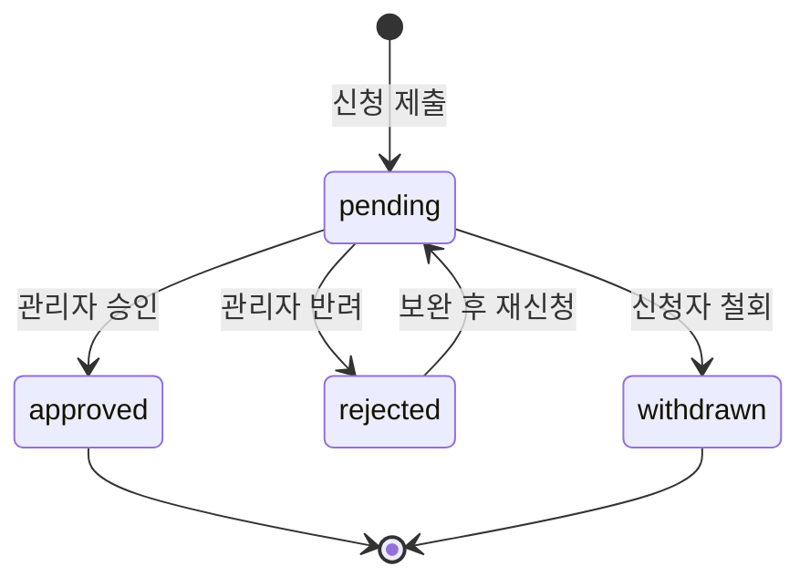
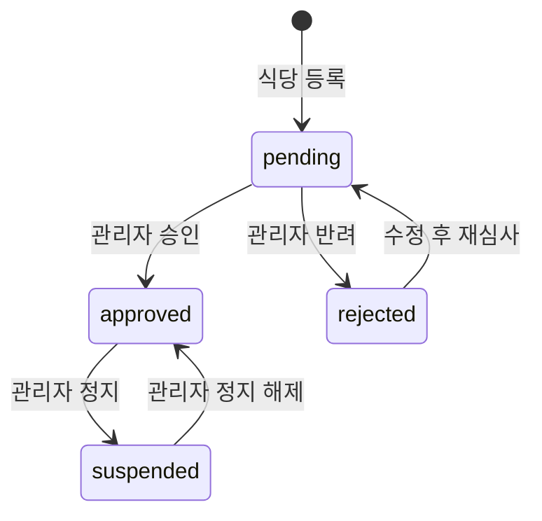
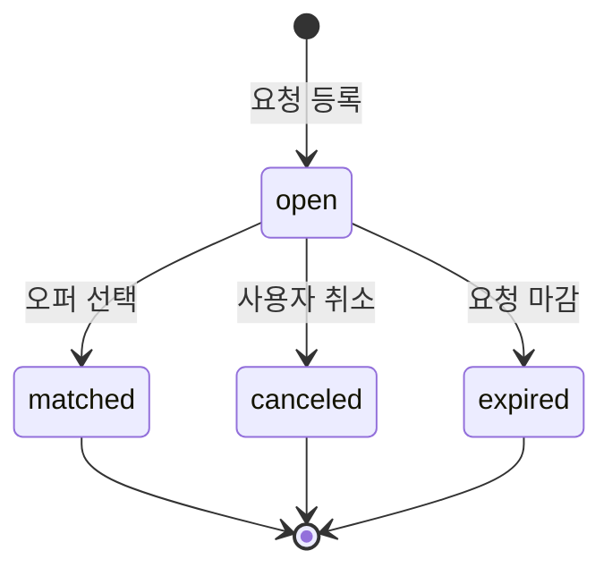
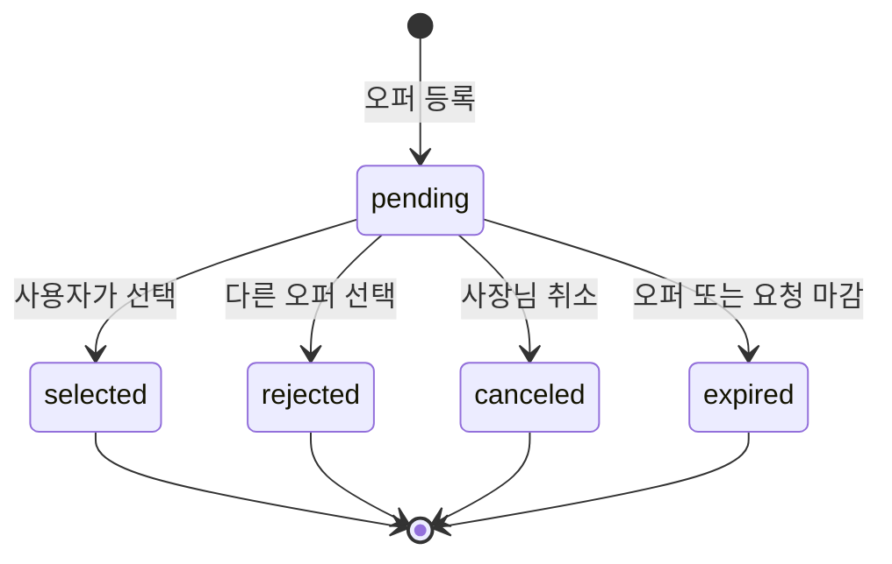
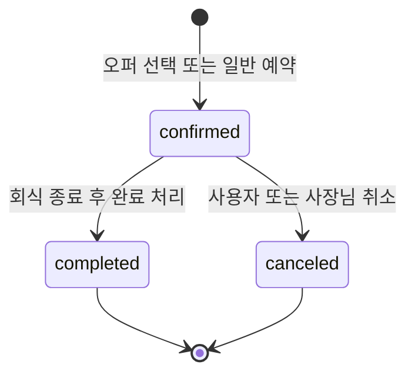
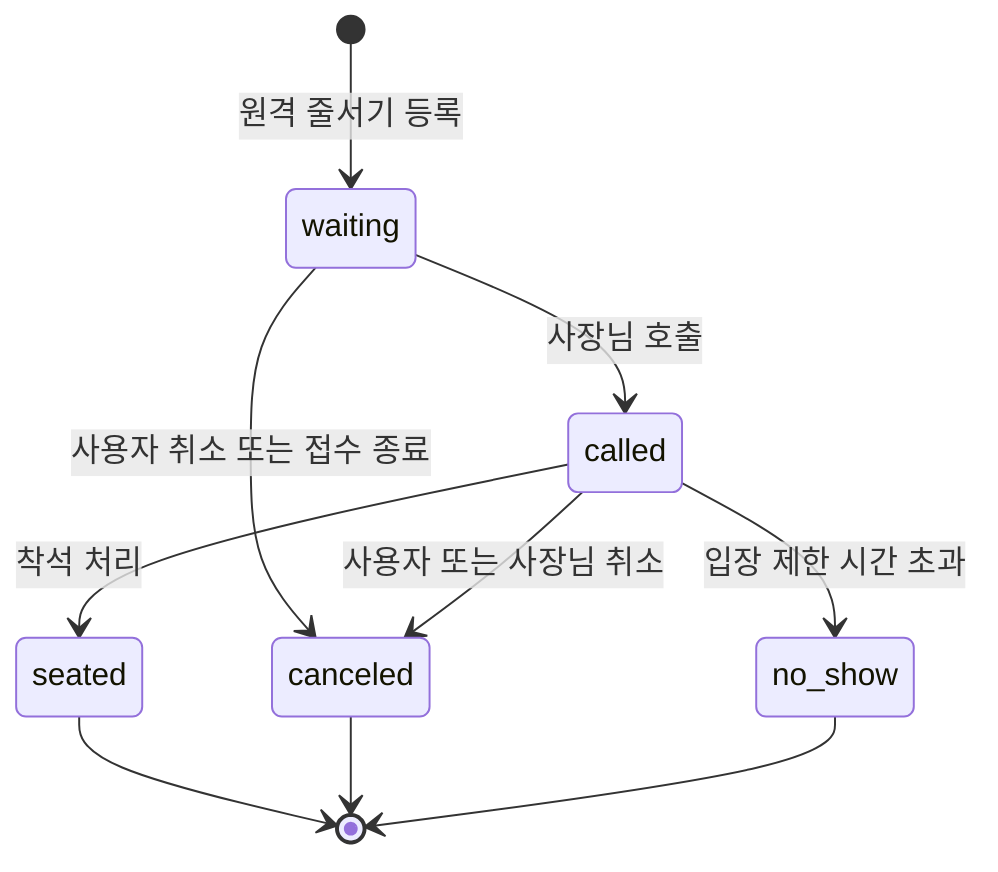

# 골라밥 상태 전이

## 1. 공통 규칙

- 상태 변경은 허용된 이전 상태에서만 수행한다.
- 상태 변경과 이력 저장은 같은 DB 트랜잭션에서 처리한다.
- API 재시도와 동시 요청으로 상태가 이미 바뀐 경우 `409 Conflict`를 반환한다.
- 시스템 만료 작업은 사용자 작업과 동일한 전이 규칙을 사용한다.

## 2. 사업자 신청



- 승인 시 `owner` 역할을 함께 부여한다.
- 반려 시 사유를 필수로 기록한다.
- 승인 후 역할 회수는 별도 관리자 감사 이벤트로 처리한다.

## 3. 식당



- `approved` 상태에서만 신규 오퍼를 작성할 수 있다.
- `suspended` 전환은 기존 예약을 자동 취소하지 않고 운영자 확인 대상으로 남긴다.

## 4. 회식 요청



| 현재 상태 | 작업 | 조건 | 결과 |
| --- | --- | --- | --- |
| open | 수정 | 유효한 오퍼가 없음 | open 유지, version 증가 |
| open | 취소 | 요청 소유자 | canceled |
| open | 오퍼 선택 | 요청 소유자, 유효한 pending 오퍼 | matched |
| open | 만료 | `offer_deadline_at <= now()` | expired |

- 오퍼가 도착한 뒤 조건을 바꾸려면 기존 요청을 취소하고 새 요청을 만든다.
- `matched` 요청의 예약 취소는 요청 상태를 되돌리지 않고 예약 이력으로 관리한다.

## 5. 오퍼



| 현재 상태 | 작업 | 조건 | 결과 |
| --- | --- | --- | --- |
| pending | 수정 | 본인 식당, 요청 open, 만료 전 | pending 유지, version 증가 |
| pending | 취소 | 본인 식당, 요청 open | canceled |
| pending | 선택 | 요청 소유자, 요청 open, 만료 전 | selected |
| pending | 자동 거절 | 같은 요청의 다른 오퍼 선택 | rejected |
| pending | 만료 | `expires_at <= now()` 또는 요청 만료 | expired |

## 6. 예약



| 현재 상태 | 작업 | 조건 | 결과 |
| --- | --- | --- | --- |
| confirmed | 사용자 취소 | 예약자 본인, 예약 시작 전, 사유 입력 | canceled |
| confirmed | 사장님 취소 | 예약 식당 owner, 예약 시작 전, 사유 입력 | canceled |
| confirmed | 완료 | 예약 종료 시각 경과 | completed |

- 취소 이력에는 `changed_by`, `actor_role`, `reason`, `created_at`을 저장한다.
- MVP에는 결제가 없으므로 취소 수수료 계산과 환불 상태는 두지 않는다.
- `offer` 예약과 `direct` 예약은 확정 이후 동일한 상태 전이를 사용한다.

## 7. 오퍼 선택 트랜잭션

```text
BEGIN
  SELECT dining_request FOR UPDATE
  CHECK owner, status = open, deadline

  SELECT selected_offer FOR UPDATE
  CHECK request relation, status = pending, expiry

  INSERT reservation
  UPDATE selected_offer SET status = selected
  UPDATE other pending offers SET status = rejected
  UPDATE dining_request SET status = matched
  INSERT request/offer/reservation status histories
COMMIT
```

- `reservations.dining_request_id UNIQUE`가 같은 요청의 동시 선택을 차단한다.
- `reservations.accepted_offer_id UNIQUE`가 같은 오퍼의 중복 예약을 차단한다.
- 같은 `Idempotency-Key` 재요청은 최초 성공 응답을 반환한다.

## 8. 일반 예약 트랜잭션

```text
BEGIN
  SELECT approved restaurant FOR UPDATE
  CHECK owner, business hours, max capacity
  CHECK conflicting reservations

  INSERT direct reservation
  INSERT reservation status history
COMMIT
```

- 동일 사용자의 중복 제출은 `Idempotency-Key`로 방지한다.
- 식당의 시간대별 수용량 정책이 정의되기 전까지 동일 시간 예약 충돌을 보수적으로 검사한다.

## 9. 원격 웨이팅



| 현재 상태 | 작업 | 조건 | 결과 |
| --- | --- | --- | --- |
| waiting | 호출 | 본인 식당 owner, 원칙적으로 대기 순번 최상위 | called |
| waiting | 취소 | 등록 사용자 또는 본인 식당 owner | canceled |
| called | 착석 | 본인 식당 owner, 제한 시간 이내 | seated |
| called | 취소 | 등록 사용자 또는 본인 식당 owner, 사유 입력 | canceled |
| called | 노쇼 | 본인 식당 owner 또는 제한 시간 만료 작업 | no_show |

- 식당별 영업일 대기 번호는 DB에서 원자적으로 증가시킨다.
- 같은 사용자는 같은 식당에 `waiting` 또는 `called` 상태 항목을 하나만 가질 수 있다.
- 호출 순서를 건너뛰면 사유를 상태 이력에 저장한다.
- 접수 마감은 신규 등록만 막고 이미 등록된 대기열은 유지한다.

## 10. 만료 처리

- 요청 조회 시점에는 마감된 `open` 요청을 노출하지 않는다.
- 주기 작업은 마감된 요청과 오퍼를 작은 배치로 잠그고 만료 처리한다.
- 주기 작업 전에도 생성·수정·선택 API가 마감 시각을 직접 검증한다.
- 배치 실패는 다음 실행에서 재시도할 수 있도록 전이를 멱등하게 만든다.
